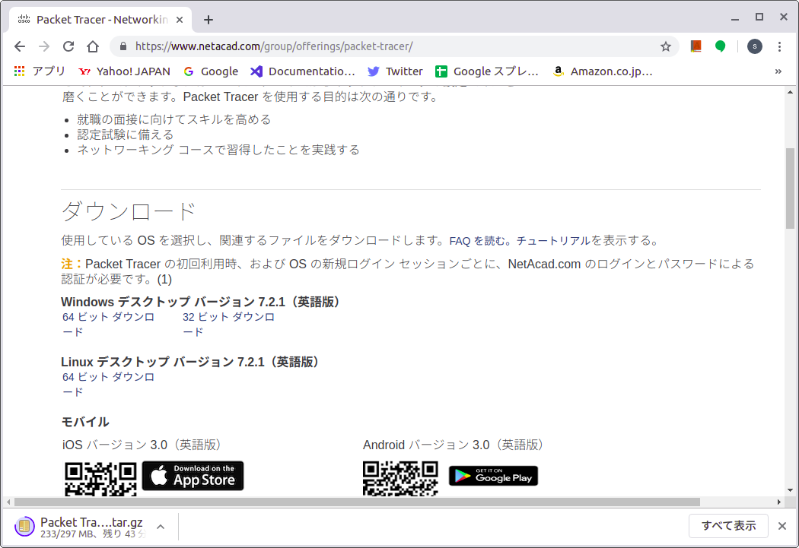

# Cisco Packet Tracer 8.0.1 on Ubuntu 21.04
バージョン8になって、すんなりインストールできるようになりました。
1. Cisco Networking Academy （ https://www.netacad.com/ja ）から「CiscoPacketTracer_801_ubuntu_64bit.deb」をダウンロードする。  

2. 「ソフトウェアのインストール」（GUI）でインストールしようとすると、エラーになる。※インストールの途中でライセンスの確認があるため？
```sh
packettracer をインストールできません：  
Error while installing package:  
new packettracer package pre-installation script subprocess returned error exit status 1 
```
  

3. コマンドでインストールする。
```sh
$ sudo apt-get install CiscoPacketTracer_801_ubuntu_64bit.deb  
```  
  

4. ライセンスに同意する。tabキーを押して<了解>を反転させる。
  
  

5. 初回ログイン時、マルチユーザーモードで起動するか訊かれる。（複数人で演習する用。私はNoとしています）
  

6. 初回ログイン時、サインインを求められます。Cisco Networking Academy のアカウントでログインします。
  
  

7. 起動します。

# Cisco Packet Tracer で遊ぼう！
●1．環境の用意
|項目|やること|リンク・動画|
|---|---|---|
|PTをダウンロード|Cisco Networking Academy にアカウント作成|https://www.netacad.com/ja
|PTをインストール|aptでインストール|
|PTの初回起動|CNAのアカウントでログイン|

●2．演習1：LANを構築
|項目|やること|リンク・動画|
|---|---|---|
|PC2台のLAN構築|スイッチングHUBに接続し、pingで疎通確認|

●3．演習2：VLANを構築
|項目|やること|リンク・動画|
|---|---|---|
|L3SW、L2SWでVLAN構築|複数セグメントをもつLANを構築|

●4．演習3：静的ルーティング（static）
|項目|やること|リンク・動画|
|---|---|---|
|2台のルーターで静的ルーティング||

●5．演習4：動的ルーティング（RIP、OSPF、BGP）
|項目|やること|リンク・動画|
|---|---|---|
|3台のルーターで動的ルーティング||


|コンフィグレーションモード名|プロンプト|説明|
|---|---|---|
|グローバルコンフィグレーションモード|(config)#|CISCO機器全体に関わる設定|
|インターフェースコンフィグレーションモード|(config-if)#|ポートなど機器のインターフェース部分の設定|
|ルータコンフィグレーションモード|(config-router)#|ルーティングプロトコル部分の設定|
|ラインコンフィグレーションモード|(config-line)#|ライン (console, aux, vty) 部分の設定|
|VLANコンフィグレーションモード|(config-vlan)#|VLANの設定|

# Cisco Packet Tracer 7.2.1 on Ubuntu 18.10
Cisco Packet Tracer 7.2.1 をUbuntu 18.10 で動かす手順です。
あまりバージョンアップが活発ではないと思っていたらいつのまにか7.2.1になっていたので、18.10 への対応を期待したのですが、やはり16.04向けという扱いのようで、インストール後そのまま起動しようとしてもライブラリのバージョンが合わずエラーになって起動できませんので、このあたりのWorkaround を書いておきたいと思います。  
  
1. Cisco Networking Academy から「Packet Tracer 7.2.1 for Linux 64 bit.tar.gz」をダウンロードする。  
  
  
2. 適当なフォルダーを作ってそのなかに展開する。  
  
  
3. インストールする。  
```sh
$ cd ~/PT  
$ ./install  
```  
  
  
4. 途中で「/opt に/pt ってフォルダ作って中にファイルをコピーするのに、sudo する？」って訊かれるので入力。  
  
  
5. 「/usr/local/bin にシンボリックリンク作る？」と訊かれるのでyを押下。
  
  
6. さっそく、「/opt/pt/bin」に移って起動させてみるが、「error while loading shared libraries: libpng12.so.0: cannot open shared object file: No such file or directory」となる。7.2.1 になって、7.1 の時よりはエラーが少なくなってる感じはする。
  
  
7. 対応として、おとなしく16.04にインストールして使う、という手もあると思いますが、それは特にひっかかるところなくインストールできるので、ここでは、あえて18.10 でなんとかする方法を。「libpng12 ubuntu」でググると、Debian とかUbuntu のパッケージダウンロードサイトとかがあるようなので、そこからなるべく良さげ（抽象的）なのをダウンロードします。私は  
https://packages.ubuntu.com/xenial/libpng12-0  
  からダウンロードしました。
  
  
  
  
  
8. ダウンロードしてきたファイルをダブルクリックなどするとUbuntu ソフトウェアで開くので、インストールします。
  
  
9. 改めてPacketTracer を起動してみると、今度はうまくいきそうです。「初回起動なんで、ユーザーファイルを/home/hogehoge/pt 配下に保存しますよ。」と言われます。
  
  
10. 次に、「Cisco Networking Academy」のアカウントでのログインを求められます。これをせずに「Guest Login」することもできますが、その場合はファイル保存ができないなど利用が限定されてしまいます。アカウントはサイトで無料で作成できます。
  
  
11. 無事起動しました！見た目ちょっと変わった？  
と、これでもういいのですが・・・
  
  
12. このままだと、デスクトップアイコンがなかったり、スタートメニューショートカットがないので、作っていきます。  
  
  
13. 「/opt/pt/bin」にある「Cisco-PacketTracer.desktop」を「~/デスクトップ」にコピーして、一部を書き換えます。
```sh
$ cd /opt/pt/bin
$ cp Cisco-PacketTracer.desktop ~/デスクトップ
$ gedit ~/デスクトップ/Cisco-PacketTracer.desktop
```  
  
  
14.「Exec=packettracer」のパスを「Exec=/opt/pt/packettracer」に直します。  
  
  
15. ファイルに実行権を付与します。  
```sh
$ chmod +x ~/デスクトップ/Cisco-PacketTracer.desktop
```  
  

16. 警告がでますが、OKすると、アイコンができます！  
  
  
  
17. さらにこのアイコンを、アプリボタンを押下したときにも出てくるようにします。  
```sh
$ cp ~/デスクトップ/Cisco-PacketTracer.desktop /usr/share/applications/
```  
「お気に入りに追加」すれば、Dock に出てきます。
  
  
  
以上です。enjoy!  
  
●参考にしたサイト：
https://www.sysnettechsolutions.com/en/ciscopackettracer/install-cisco-packet-tracer-7-2-ubuntu-18-10/
